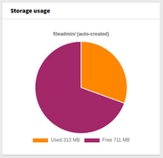
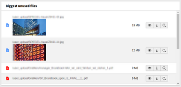
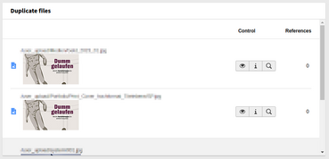
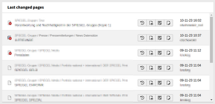
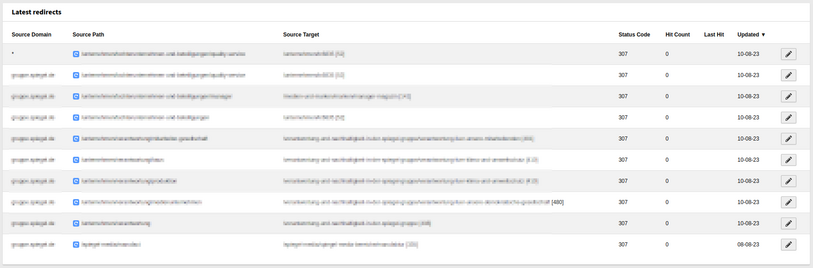
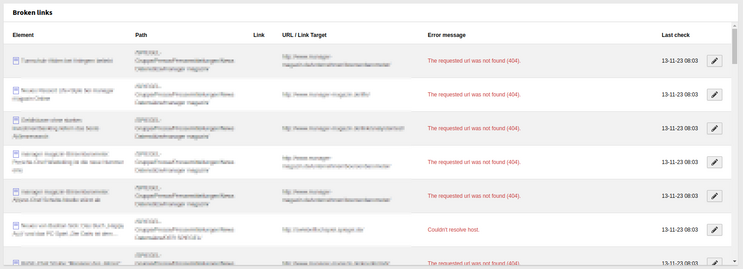
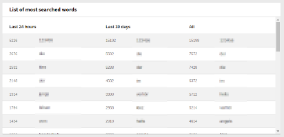

# Editor widgets
Collection of dashboard widgets designed for TYPO3 editors

## Widgets
### Storage usage
Shows the used storage size in percent from the configured maximum.



### Biggest unused files
Shows the top 10 biggest files that are not used.
(Entries from sys_file that do not have an entry in sys_refindex)



### Duplicate files
Shows a list of suspected, duplicated files based on the sha1-hash from sys_file.



### Last changed pages
Simply a list of the last 10 edited pages that are accessible by the current backend user.



### Latest redirects
The last 10 updated redirects.

**Please note:** For this widget the core extension `typo3/cms-redirects` must be installed.



### Broken links
Shows a list of all broken links with page, element, target and error message.

**Please note:** For this widget the core extension `typo3/cms-linkvalidator` must be installed and active as the list is taken directly from the LinkValidator table.



### List of most searched words
Shows a list of most search words from the onsite search. The list is separated in search words from the last 24 hours, the last 30 days and all time.

**Please note:** For this widget the core extension `typo3/cms-indexed-search` must be installed and statistics active.




## Installation
Use composer to add the extension:
```
composer require "sitegeist/editor-widgets"
```
* Flush Caches
* Configure the max size for the default storage

## Configuration
### Storage size

The maximum storage size is configures in extension configuration. You can enter a value in bytes or simply KB, MB, GB.

**Please note:** This value is only used for displaying how much space is used. There is no real limit.

## Migration from Version 1 to 2

The **maximum storage size** is now configured in extension configuration instead of file storage record.

## Special thanks
*The development and the public-releases of this package is generously sponsored
by SPIEGEL-Verlag Rudolf Augstein GmbH & Co. KG*

## Authors & Sponsors
* SPIEGEL-Verlag Rudolf Augstein GmbH & Co. KG
* [Benjamin Tammling](https://github.com/Atomschinken)
* [Ulrich Mathes](https://github.com/ulrichmathes)
* [All contributors](https://github.com/sitegeist/editor-widgets/graphs/contributors)
